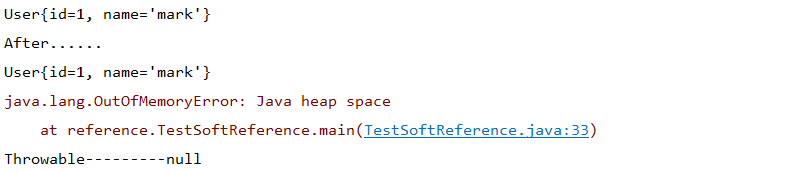
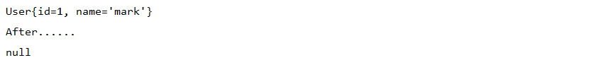

# Gc垃圾回收

## 各种引用（Refenrence）
- 强引用（**=**）
- 软引用（**SoftRefenrence**）
- 弱引用（**WeakReference**） 
- 虚引用（**PhantomReference**）
### 强引用：
强引用是平常中使用最多的引用，强引用在程序内存不足（OOM）的时候也不会被回收，使用方式：
```java
String str = new String("str");
```
这个str就是强引用。 
可用场景： 
地球人都知道，但是我讲不出来。
### 软引用：
软引用在程序内存不足时，会被回收,内存足够时不会。使用方式：

```java
// 注意：wrf这个引用也是强引用，它是指向SoftReference这个对象的，
// 这里的软引用指的是指向new String("str")的引用，也就是SoftReference类中T
SoftReference<String> wrf = new SoftReference<String>(new String("str"));
```
可用场景： 
创建缓存的时候，创建的对象放进缓存中，当内存不足时，JVM就会回收早先创建的对象。PS：图片编辑器，视频编辑器之类的软件可以使用这种思路。 
软引用使用例子传送门：https://www.cnblogs.com/mjorcen/p/3968018.html
```java

    public static class User{
        private int id=0;
        private String name;
        public User(int id,String name){
            super();
            this.id=id;
            this.name=name;
        }
        @Override
        public String toString() {
            return "User{" +"id=" + id + ", name='" + name + '\'' +'}';
        }
    }

    public static void main(String[] args) {
        User u=new User(1,"mark");
        SoftReference<User> userSoft=new SoftReference<>(u);
        u=null;//保证new User(1,"mark")这个实例只有软引用
        System.out.println(userSoft.get());
        System.gc();//展示Gc的时候SoftReference 不一定会被回收
        System.out.println("After......");
        System.out.println(userSoft.get());
        List<byte[]> list=new LinkedList<>();
        try {
            for (int i = 0; i <10 ; i++) {
                list.add(new byte[1024*1024*1]);
            }
        } catch (Throwable e) {
            e.printStackTrace();
            System.out.println("Throwable---------"+userSoft.get());
        }
    }
```
输出

### 弱引用:
弱引用就是只要JVM垃圾回收器发现了它，就会将之回收，使用方式：
```java
WeakReference<String> wrf = new WeakReference<String>(str);
```
在强度上弱于软引用，通过类WeakReference来表示。它的作用是引用一个对象，但是并不阻止该对象被回收。如果使用一个强引用的话，只要该引用存在，那么被引用的对象是不能被回收的。弱引用则没有这个问题。在垃圾回收器运行的时候，如果一个对象的所有引用都是弱引用的话，该对象会被回收。弱引用的作用在于解决强引用所带来的对象之间在存活时间上的耦合关系。弱引用最常见的用处是在集合类中，尤其在哈希表中。哈希表的接口允许使用任何Java对象作为键来使用。当一个键值对被放入到哈希表中之后，哈希表对象本身就有了对这些键和值对象的引用。如果这种引用是强引用的话，那么只要哈希表对象本身还存活，其中所包含的键和值对象是不会被回收的。如果某个存活时间很长的哈希表中包含的键值对很多，最终就有可能消耗掉JVM中全部的内存。
对于这种情况的解决办法就是使用弱引用来引用这些对象，这样哈希表中的键和值对象都能被垃圾回收。Java中提供了WeakHashMap来满足这一常见需求。
可用场景： 
Java源码中的java.util.WeakHashMap中的key就是使用弱引用，我的理解就是，一旦我不需要某个引用，JVM会自动帮我处理它，这样我就不需要做其它操作。 

```java
 public static void main(String[] args) {
        User u=new User(1,"mark");
        WeakReference<User> userSoft=new WeakReference<>(u);
        u=null;//保证new User(1,"mark")这个实例只有软引用
        System.out.println(userSoft.get());
        System.gc();//展示Gc的时候SoftReference 不一定会被回收
        System.out.println("After......");
        System.out.println(userSoft.get());
    }
```
 
### 虚(幽灵)引用（PhantomReference）
虚引用的存在对对象没有任何作用，一般用于对象被销毁后的通知。虚引用的回收机制跟弱引用差不多，但是它被回收之前，会被放入ReferenceQueue中。注意，其它引用是被JVM回收后才被传入ReferenceQueue中的。由于这个机制，所以虚引用大多被用于引用销毁前的处理工作。还有就是，虚引用创建的时候，必须带有ReferenceQueue，使用例子：

```java 
PhantomReference<String> prf = new PhantomReference<String>(new String("str"), new ReferenceQueue<>());
```

　　在介绍幽灵引用之前，要先介绍Java提供的对象终止化机制（finalization）。在Object类里面有个finalize方法，其设计的初衷是在一个对象被真正回收之前，可以用来执行一些清理的工作。因为Java并没有提供类似C++的析构函数一样的机制，就通过 finalize方法来实现。但是问题在于垃圾回收器的运行时间是不固定的，所以这些清理工作的实际运行时间也是不能预知的。幽灵引用（phantom reference）可以解决这个问题。在创建幽灵引用PhantomReference的时候必须要指定一个引用队列。当一个对象的finalize方法已经被调用了之后，这个对象的幽灵引用会被加入到队列中。通过检查该队列里面的内容就知道一个对象是不是已经准备要被回收了。

　　幽灵引用及其队列的使用情况并不多见，主要用来实现比较精细的内存使用控制，这对于移动设备来说是很有意义的。程序可以在确定一个对象要被回收之后，再申请内存创建新的对象。通过这种方式可以使得程序所消耗的内存维持在一个相对较低的数量。比如下面的代码给出了一个缓冲区的实现示例。
```java
public class PhantomBuffer {
  private byte[] data = new byte[0];
    private ReferenceQueue<byte[]> queue = new ReferenceQueue<byte[]>();
    private PhantomReference<byte[]> ref = new PhantomReference<byte[]>(data, queue);
    public byte[] get(int size) {
        if (size <= 0) {
            throw new IllegalArgumentException("Wrong buffer size");
        }
        if (data.length < size) {
            data = null;
            System.gc(); //强制运行垃圾回收器
             try {
                queue.remove(); //该方法会阻塞直到队列非空
                ref.clear(); //幽灵引用不会自动清空，要手动运行
                ref = null;
                data = new byte[size];
                ref = new PhantomReference<byte[]>(data, queue);
            } catch (InterruptedException e) {
                e.printStackTrace();
            }
       }
       return data;
    }
}
```
　在上面的代码中，每次申请新的缓冲区的时候，都首先确保之前的缓冲区的字节数组已经被成功回收。引用队列的remove方法会阻塞直到新的幽灵引用被加入到队列中。不过需要注意的是，这种做法会导致垃圾回收器被运行的次数过多，可能会造成程序的吞吐量过低。
#### 引用队列
　　在有些情况下，程序会需要在一个对象的可达到性发生变化的时候得到通知。比如某个对象的强引用都已经不存在了，只剩下软引用或是弱引用。但是还需要对引用本身做一些的处理。典型的情景是在哈希表中。引用对象是作为WeakHashMap中的键对象的，当其引用的实际对象被垃圾回收之后，就需要把该键值对从哈希表中删除。有了引用队列（ReferenceQueue），就可以方便的获取到这些弱引用对象，将它们从表中删除。在软引用和弱引用对象被添加到队列之前，其对实际对象的引用会被自动清空。通过引用队列的poll/remove方法就可以分别以非阻塞和阻塞的方式获取队列中的引用对象。