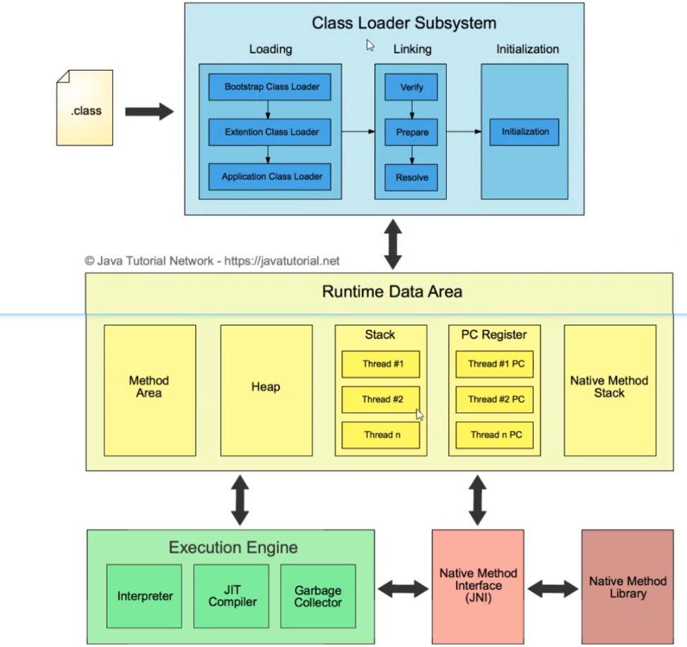
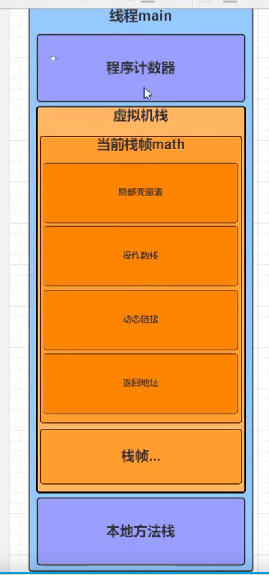

# 1. JVM虚拟机
hotspot(官方)
Java虚拟机（Java Virtual Machine 简称JVM）,一种能够运行Java字节码的虚拟机。有独特的字符集、编译文件格式。作为一种编程语言的虚拟机，实际上不止用于Java，只要生成的编译文件匹配JVM对加载编译文件格式的要求，任何语言都可以由JVM编译运行，比如kotlin、scala等。
## 1.1. JVM的基本结构
JVN由三个主要的子系统构成：
+ 类加载子系统
+ 运行时数据区（内存结构）
+ 执行引擎


## 1.2. 类的加载机制
加载过程主要完成三件事情：

1. 通过类的全限定名来获取定义此类的二进制字节流
2. 将这个类字节流代表的静态存储结构转为方法区的运行时数据结构
3. 在堆中生成一个代表此类的java.lang.Class对象，作为访问方法区这些数据结构的入口。  

这个过程主要就是类加载器完成。
类加载有三种方式：

1. 命令行启动应用时候由JVM初始化加载
2. 通过Class.forName()方法动态加载
3. 通过ClassLoader.loadClass()方法动态加载
### 1.2.1. 类的生命周期

1. 加载
通过全限定名确定一个类，将.class文件从磁盘（或网络上读取字节流）读取到内存。
2. 连接
    - 验证
    验证字节码文件的正确性
    - 准备
    给类的静态文件分配内存，并赋予默认值（并非定义的值，类型的默认值：Boolean-false,int-0）。
    - 解析
    装入加载的类引用的其他所有类。
3. 初始化
    为类的静态变量赋予争取的初始值（程序编写着为变量赋予的真正的值：private static int count=10）
4. 使用
5. 卸载
### 1.2.2. 类加载器的种类
#### 1.2.2.1. 启动类加载器(Bootstrap classLoader):
又称为引导类加载器，由C++编写，无法通过程序得到。主要负责加载JAVA中的一些核心类库，主要是加载rt.jar、charsets.jar等。
#### 1.2.2.2. 拓展类加载器(Extension classLoader):
主要加载JAVA中的一些拓展类，负责加载jre扩展目录ext中的jar类包。
#### 1.2.2.3. 应用类加载器(System classLoader):    
又称为系统类加载器,主要用于加载CLASSPATH路径下我们自己写的类，是拓展类加载器的子类。
#### 1.2.2.4. 用户自定义类加载器（User classLoader）
负责加载用户自定义路径下的类包

```
    public static void main(String[] args) {
        HashMap map=new HashMap();
        beanf bed=new beanf();

        System.out.println(map.getClass().getClassLoader());
        System.out.println(DESKeyFactory.class.getClassLoader());
        System.out.println(bed.getClass().getClassLoader());
    }
java
```

因为 java.util.HashMap在 rt.jar中。所以是启动加载器加载进来的。而启动类加载器使用C++代码写的，无法通过程序得到。

比如我们自己写了一个类Student类，经过编译后会得到Student.class文件，然后经过类加载器得到Class实例，例如通过Class.forName("com.***.Student"),通过全路径加载进来。然后我们用Student.class.getClassLoader()得到它的类加载器，得到的是AppClassLoader(即系统类加载器),如果用Student.class.getClassLoader().getParent()得到的是它的父加载器ExtClassLoader（即拓展类加载器）,然后用Student.class.getClassLoader().getParent().getParent()得到将会是Null，因为启动类加载器是用C++写的，我们无法通过程序直接得到。

#### 1.2.2.5. 类的加载机制

##### 1.2.2.5.1.  全盘负责委派机制：
```text
当一个类加载器负责加载某个Class时，该Class所依赖的和引用的其他Class也将由该类加载器负责载入，除非显示使用另外一个类加载器来载入
```
##### 1.2.2.5.2. 双亲委派机制：
```text
先让父类加载器试图加载该类，只有在父类加载器无法加载该类时才尝试从自己的类路径中加载该类
```
##### 1.2.2.5.3. 双亲委派机制的优点
+ 沙箱安全机制：

    比如自己写的String.calss文件不会被加载，可以防止核心库被随意篡改。  


```java
package java.lang;

public class String {
    static{
        System.out.println("my String started!!!");//可以执行恶意代码
    }

    public static void main(String[] args) {
        String a="dasdas";
    }
}
```

    当自定义了` java.lang.String`的时候，使用双亲委派加载机制时，一层层向上委托至启动类加载器。Bootstrap classLoader 确认` java.lang.String`是由他加载，但是Bootstrap classLoader只加载rt.jar里的Stringl类，所以自己写的这个类实际并没有被加载。

+ 避免类的重复加载：

    当父类ClassLoader已经加载过了该类的时候，就不需要子ClassLoader再加载一次。
#### 1.2.2.6. 打破双亲委派机制eg
  + Tomcat:  
    为了隔离多个war包，允许每个war包可因引入自己需要的类，可以配置打破双亲委派机制。
  + 热部署：  
   ** 缓存机制:**
    缓存机制将会保证所有加载过的Class都会被缓存，当程序中需要使用某个Class时，类加载器先从缓存区寻找该Class，只有缓存区不存在，系统才会读取该类对应的二进制数据，并将其转换成Class对象，存入缓存区。这就是为什么修改了Class后，必须重启JVM，程序的修改才会生效。
    打破双亲委派机制后，使用自己定义的类加载器加载类的时候，加载的类和之前的类是不一样的类。所以不会使用缓存机制。

#### 1.2.2.7. 常见问题:

   1.Object类是由哪个类加载器加载的?

      BootStrap ClassLoader
   2.我们自己写的类是由哪个类加载器加载的?

     System ClassLoader
   3.类加载器都是我们Java中的一个类ClassLoader的子类吗?

    BootStrap ClassLoader不是的，另外两个是的。
   4.能不能自己写个类叫java.lang.System？

    通常不可以，但可以采取另类方法达到这个需求,为了不让我们写System类，类加载采用委托机制，这样可以保证爸爸们优先，爸爸们能找到的类，儿子就没有机会加载。而System类是Bootstrap加载器加载的，就算自己重写，也总是使用Java系统提供的System，自己写的System类根本没有机会得到加载。但是，我们可以自己定义一个类加载器来达到这个目的，为了避免双亲委托机制，这个类加载器也必须是特殊的。由于系统自带的三个类加载器都加载特定目录下的类，如果我们自己的类加载器加载一个特殊的目录，那么系统的加载器就无法加载，也就是最终还是由我们自己的加载器加载。

## 1.3. 运行时数据区


+ 粉色：线程共有，程序存储区。
+ 绿色：线程私有，程序运行区。

### 1.3.1. 一个java main方法的执行底层逻辑

``` java
public class demo1 {
    public int math(){
        int a=1;
        int b=2;
        int c=a+b;
        return c;
    }
    public static void main(String[] args) {
        demo1 de=new demo1();
        de.math();
    }
}
```

 

      
创建脚注格式类似这样  [^RUNOOB] 。
[^RUNOOB]: 菜鸟教程 -- 学的不仅是技术，更是梦想！！！