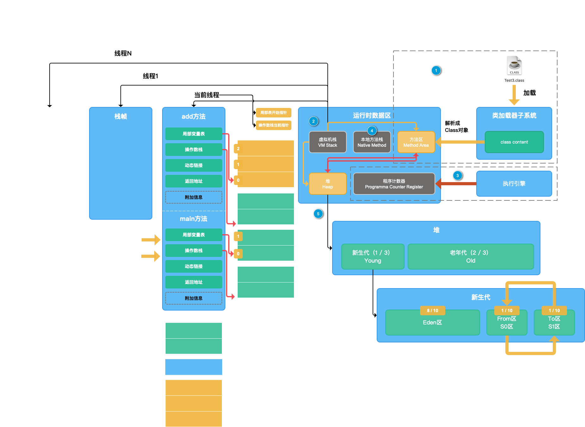
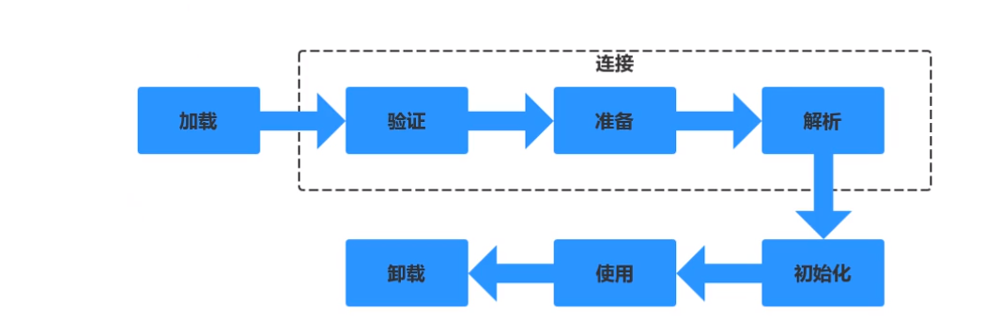
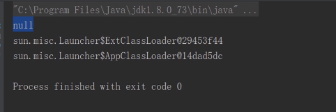
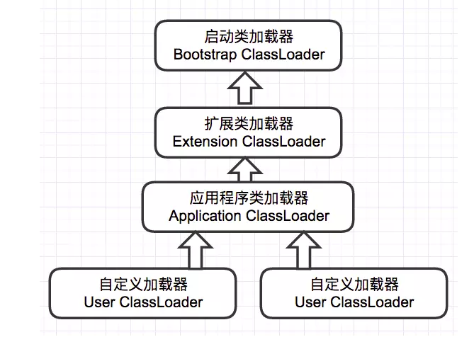
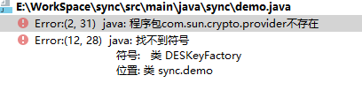
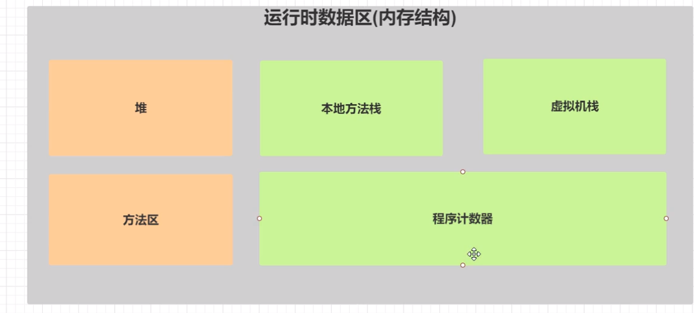
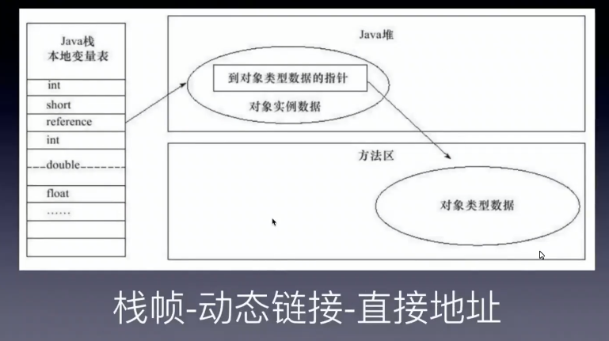
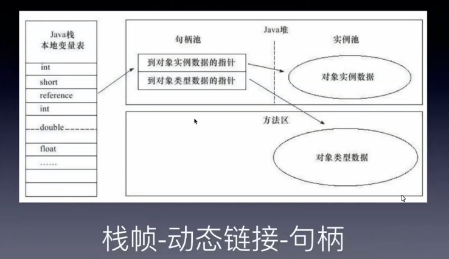
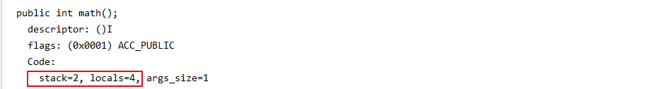
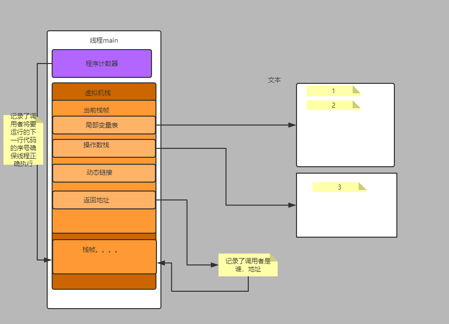

# 1. JVM虚拟机
hotspot(官方)
Java虚拟机（Java Virtual Machine 简称JVM）,一种能够运行Java字节码的虚拟机。有独特的字符集、编译文件格式。作为一种编程语言的虚拟机，实际上不止用于Java，只要生成的编译文件匹配JVM对加载编译文件格式的要求，任何语言都可以由JVM编译运行，比如kotlin、scala等。
## 1.1. JVM的基本结构
JVM由三个主要的子系统构成：
+ 类加载子系统
+ 运行时数据区（内存结构）
+ 执行引擎


### 1.1.1 四个概念
 - .class文件 : java编译后在硬盘上存在的文件
 - class content : 类加载器把class文件加载到内存去，这片内存区域叫做class content
 - class对象 : 类加载器基于jvm规范把class content内容解析完成生成的对象。
 - 对象 : 使用new关键字生成的对象。
## 1.2. 类加载器
加载过程主要完成三件事情：

1. 通过类的全限定名来获取定义此类的二进制字节流
2. 将这个类字节流代表的静态存储结构转为方法区的运行时数据结构
3. 在堆中生成一个代表此类的java.lang.Class对象，作为访问方法区这些数据结构的入口。  

这个过程主要就是类加载器完成。
类加载有三种方式：

1. 命令行启动应用时候由JVM初始化加载
2. 通过Class.forName()方法动态加载
3. 通过ClassLoader.loadClass()方法动态加载
### 1.2.1. 类的生命周期

1. 加载
通过全限定名确定一个类，将.class文件从磁盘（或网络上读取字节流）读取到内存。
2. 连接
    - 验证
    验证字节码文件的正确性
    - 准备
    给类的静态文件分配内存，并赋予默认值（并非定义的值，类型的默认值：Boolean-false,int-0）。
    - 解析
    装入加载的类引用的其他所有类。
3. 初始化
    为类的静态变量赋予争取的初始值（程序编写着为变量赋予的真正的值：private static int count=10）
4. 使用
5. 卸载
### 1.2.2. 类加载器的种类
#### 1.2.2.1. 启动类加载器(Bootstrap classLoader):
又称为引导类加载器，由C++编写，无法通过程序得到。主要负责加载JAVA中的一些核心类库，主要是加载rt.jar、charsets.jar等。
#### 1.2.2.2. 拓展类加载器(Extension classLoader):
主要加载JAVA中的一些拓展类，负责加载jre扩展目录ext中的jar类包。
#### 1.2.2.3. 应用类加载器(System classLoader):    
又称为系统类加载器,主要用于加载CLASSPATH路径下我们自己写的类，是拓展类加载器的子类。
#### 1.2.2.4. 用户自定义类加载器（User classLoader）
负责加载用户自定义路径下的类包

```java
    public static void main(String[] args) {
        HashMap map=new HashMap();
        beanf bed=new beanf();

        System.out.println(map.getClass().getClassLoader());
        System.out.println(DESKeyFactory.class.getClassLoader());
        System.out.println(bed.getClass().getClassLoader());
    }

```

因为 java.util.HashMap在 rt.jar中。所以是启动加载器加载进来的。而启动类加载器使用C++代码写的，无法通过程序得到。

比如我们自己写了一个类Student类，经过编译后会得到Student.class文件，然后经过类加载器得到Class实例，例如通过Class.forName("com.***.Student"),通过全路径加载进来。然后我们用Student.class.getClassLoader()得到它的类加载器，得到的是AppClassLoader(即系统类加载器),如果用Student.class.getClassLoader().getParent()得到的是它的父加载器ExtClassLoader（即拓展类加载器）,然后用Student.class.getClassLoader().getParent().getParent()得到将会是Null，因为启动类加载器是用C++写的，我们无法通过程序直接得到。

#### 1.2.2.5. 类的加载机制

##### 1.2.2.5.1.  全盘负责委派机制：
```text
当一个类加载器负责加载某个Class时，该Class所依赖的和引用的其他Class也将由该类加载器负责载入，除非显示使用另外一个类加载器来载入
```
##### 1.2.2.5.2. 双亲委派机制：
```text
先让父类加载器试图加载该类，只有在父类加载器无法加载该类时才尝试从自己的类路径中加载该类
```
##### 1.2.2.5.3. 双亲委派机制的优点
+ 沙箱安全机制：

    比如自己写的String.calss文件不会被加载，可以防止核心库被随意篡改。  


```java
package java.lang;

public class String {
    static{
        System.out.println("my String started!!!");//可以执行恶意代码
    }

    public static void main(String[] args) {
        String a="dasdas";
    }
}
```

    当自定义了` java.lang.String`的时候，使用双亲委派加载机制时，一层层向上委托至启动类加载器。Bootstrap classLoader 确认` java.lang.String`是由他加载，但是Bootstrap classLoader只加载rt.jar里的Stringl类，所以自己写的这个类实际并没有被加载。

+ 避免类的重复加载：

    当父类ClassLoader已经加载过了该类的时候，就不需要子ClassLoader再加载一次。
#### 1.2.2.6. 打破双亲委派机制eg
  + Tomcat:  
    为了隔离多个war包，允许每个war包可因引入自己需要的类，可以配置打破双亲委派机制。
  + 热部署：  
   ** 缓存机制:**
    缓存机制将会保证所有加载过的Class都会被缓存，当程序中需要使用某个Class时，类加载器先从缓存区寻找该Class，只有缓存区不存在，系统才会读取该类对应的二进制数据，并将其转换成Class对象，存入缓存区。这就是为什么修改了Class后，必须重启JVM，程序的修改才会生效。
    打破双亲委派机制后，使用自己定义的类加载器加载类的时候，加载的类和之前的类是不一样的类。所以不会使用缓存机制。

#### 1.2.2.7. 常见问题:

   1.Object类是由哪个类加载器加载的?

      BootStrap ClassLoader
   2.我们自己写的类是由哪个类加载器加载的?

     System ClassLoader
   3.类加载器都是我们Java中的一个类ClassLoader的子类吗?

    BootStrap ClassLoader不是的，另外两个是的。
   4.能不能自己写个类叫java.lang.System？

    通常不可以，但可以采取另类方法达到这个需求,为了不让我们写System类，类加载采用委托机制，这样可以保证爸爸们优先，爸爸们能找到的类，儿子就没有机会加载。而System类是Bootstrap加载器加载的，就算自己重写，也总是使用Java系统提供的System，自己写的System类根本没有机会得到加载。但是，我们可以自己定义一个类加载器来达到这个目的，为了避免双亲委托机制，这个类加载器也必须是特殊的。由于系统自带的三个类加载器都加载特定目录下的类，如果我们自己的类加载器加载一个特殊的目录，那么系统的加载器就无法加载，也就是最终还是由我们自己的加载器加载。

## 1.3. 运行时数据区



+ 粉色：线程共有，程序存储区。
+ 绿色：线程私有，程序运行区。

### 1.3.1 方法区
#### 1.3.1.1 （静态）常量池：
  所谓静态常量池，即*.class文件中的常量池，class文件中的常量池不仅仅包含字符串(数字)字面量，还包含类、方法的信息，占用class文件绝大部分空间。当编译一个Java程序的时候，会得到程序中每个类或者接口的独立的class文件，当程序运行的时候，JVM转载程序的类和接口，在动态连接的过程中把它们互相勾连起来。Class文件把它所有的符号引用保存在常量池，每一个被JVM装载的类或接口都有一份内部版本的常量池。这种常量池主要用于存放两大类常量：字面量(Literal)和符号引用量(Symbolic References)，字面量相当于Java语言层面常量的概念，如文本字符串，声明为final的常量值等，符号引用则属于编译原理方面的概念。包括了如下三种类型的常量：
- 类和接口的全限定名
- 字段名称和描述符
- 方法名称和描述符
#### 1.3.1.2 运行时常量池
  是jvm虚拟机在完成类装载操作后，将class文件中的常量池载入到内存中，并保存在方法区中，我们常说的常量池，就是指方法区中的运行时常量池。运行时常量池相对于CLass文件常量池的另外一个重要特征是具备动态性，Java语言并不要求常量一定只有编译期才能产生，也就是并非预置入CLass文件中常量池的内容才能进入方法区运行时常量池，运行期间也可能将新的常量放入池中，这种特性被开发人员利用比较多的就是String类的intern()方法。String的intern()方法会查找在常量池中是否存在一份equal相等的字符串,如果有则返回该字符串的引用,如果没有则添加自己的字符串进入常量池。
    直接引用：各种直接指向堆中实例的引用。
    符号引用：一堆字符串，方便找到实例对象。从符号引用转换为直接引用，在运行时叫做动态链接。在类加载阶段解析出来转化的叫做静态链接。
    常量池可以使用javap -v命令打印
方法区是java虚拟机的一种规范，JDK1.8开始，取消了Java方法区，取而代之的是位于直接内存的元空间（metaSpace）。
   - 永久代：存放在堆上，jdk7
  -   元空间：直接内存存放，native memory。
        - 最大：无限。
        - 最小：20.75M。（java -XX:+PrintFlagsFinal -version |grep Meta）
        - XX：MetaSpaceSize :指定元空间大小，建议设为物理内存的32分之一，服务器一般保持20-30的空余。字节为单位。一般将最大和最小设为一致，防止内存抖动：（在短时间内有大量的对象被创建或者被回收的现象，内存抖动是因为大量的对象被创建又在短时间内马上被释放。）
为什么在jdk8使用元空间取代永久代：
   - 硬件发展原因：32位机器寻址空间 = 4G。假如此时将方法区实现放在内存，内核2G,应用层共享2G,随着加载的类的多少或者死循环动态加载的多少，java会把内存吃满。 64位机器  当前保留16位，寻址空间为2的48次方。
   - 业务发展，java 主要应用于web。为了方便（无需手动调节堆大小）。

### 1.3.2 虚拟机栈
 每创建一个线程，就会给线程创建虚拟机栈，虚拟机栈是线程安全的。栈帧是每个线程里调用一个方法就会生成一个栈帧。
java -XX:+PrintFlagsFinal -version |grep Thread  查看分配大小
- 虚拟机栈
- 栈帧 （每个栈帧对应一个被调用的方法，可以理解为一个方法的运行空间。）虚拟机规范定义：
    #### 1.3.2.1 局部变量表 ：方法中定义的局部变量以及方法的形参存放在这张表中，局部变量表中的变量不可直接使用，如需要使用的话，必须通过相关指令将其加载至操作数栈中作为操作数使用。
    #### 1.3.2.2 操作数栈 ： 以压栈和出栈的方式存储操作数的。
    #### 1.3.2.3 动态链接 ：存放的就是此方法的实际地址（指向运行时常量池中该栈帧所属方法的引用），java多态调用的时候，需要先找到此方法的引用，获取方法的信息：方法名、所属类、签名等信息。占用两个slot。
    hotspot使用的是直接地址，windows系统里以句柄的形式实现的
          直接地址：
           句柄 ： 
    #### 1.3.2.4 方法返回地址
    #### 1.3.2.5 附加信息（debug之类，hotspot未使用）
局部变量表和操作数栈的大小在编译器就已经决定了（javap -verbose **）2个slot（插槽）。
 

### 1.3.2 程序计数器
- 线程私有的，生命周期随着线程，线程启动而产生，线程结束而消亡
- 是java虚拟机规范里面， 唯一 一个 没有规定任何 OutOfMemoryError 情况的区域
```java
// java 文件被翻译为字节码的时候，字节码大概类似于下面的样子
public void haha(){
// 原来的 haha 方法内部的 java 代码，被翻译为下面的类似于汇编语言的指令
    0 xxxx ....
    2 xxxx ....
    4 xx  ...
    5 xxx ...
}
```
上面左边的 0、2、4、5 ，就是类似于字节码的行号（实际是指令的偏移地址），程序计数器中保存中的值，就是它们；
多线程时，当CPU执行权从 A 线程，转移到 B 线程的时候，JVM就要暂时挂起线程 A ，去执行线程 B ；当线程 A 再次得到CPU执行权的时候，又会挂起B线程，继续执行 A 线程 。此时需要程序计数器帮助cpu记住之前执行到了哪一步，继续执行。

当线程执行的是本地方法的时候，程序计数器中保存的值是空（undefined）；原因很简单：本地方法是C++/C 写的，native方法是java通过jni调用本地C/C++库来实现，非java字节码实现，因此，程序计数器也就不会做任何记录 ；
### 1.3.3. 一个java main方法的执行底层逻辑

``` java
public class demo1 {
    public int math(){
        int a=1;
        int b=2;
        int c=a+b;
        return c;
    }
    public static void main(String[] args) {
        demo1 de=new demo1();
        de.math();
    }
}
```
使用javac命令编译demo1,java ->demo1.class
```bash
javac demo1.java
```
使用javac 命令反编译demo1.class: 
```bash
javap -c demo1.java > demo1.txt
```

demo1.txt
```c
Compiled from "demo1.java"
public class sync.Jvmm.demo1 {
  public sync.Jvmm.demo1();
    Code:
       0: aload_0
       1: invokespecial #1                  // Method java/lang/Object."<init>":()V
       4: return

  public int math();
    Code:
       0: iconst_1
       1: istore_1
       2: iconst_2
       3: istore_2
       4: iload_1
       5: iload_2
       6: iadd
       7: istore_3
       8: iload_3
       9: ireturn

  public static void main(java.lang.String[]);
    Code:
       0: new           #2                  // class sync/Jvmm/demo1
       3: dup
       4: invokespecial #3                  // Method "<init>":()V
       7: astore_1
       8: aload_1
       9: invokevirtual #4                  // Method math:()I
      12: pop
      13: return
}

```
```java
当int取值-1~5时，JVM采用iconst指令将常量压入栈中。
istore_1  弹出栈顶元素0存入位置1的局部变量中
load_1  从位置为1的局部变量中取出元素int类型的0压入栈
iadd   从栈顶弹出两个元素然后做加法，把结果压入栈
```



 ```c

public int math(){
        int a=1;
        int b=2;
        int c=a+b;
        return c;
    }

 public int math();
    Code:
       0: iconst_1       将1 压入操作数栈
       1: istore_1       弹出栈顶元素（第0个），放入序号为1的局部变量表里
       2: iconst_2      将数字2 压入操作数栈
       3: istore_2       弹出栈顶元素（第0个），放入序号为2的局部变量表里
       4: iload_1        从位置为1的局部变量中取出元素int类型的0压入栈
       5: iload_2        从位置为1的局部变量中取出元素int类型的0压入栈
       6: iadd            从栈顶弹出两个元素然后做加法，把结果压入栈
       7: istore_3       弹出栈顶元素（第0个），放入序号为3的局部变量表里
       8: iload_3        从位置为3的局部变量中取出元素int类型的值压入栈
       9: ireturn        返回给调用的栈帧（返回地址会记录调用后需要返回的地址即main方法对应的，程序计数器对应调用返回后要执行的代码。）
 ```

使用jclasslib查看，所有的非静态方法，局部变量表 index为0的位置都是this指针。
```byte
 0 new #2 <Test>
 3 dup
 4 invokespecial #3 <Test.<init>>
 7 astore_1
 8 aload_1
 9 invokevirtual #4 <Test.math>
12 pop
13 return
```
创建脚注格式类似这样  [^RUNOOB] 。
[^RUNOOB]: 菜鸟教程 -- 学的不仅是技术，更是梦想！！！