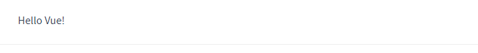
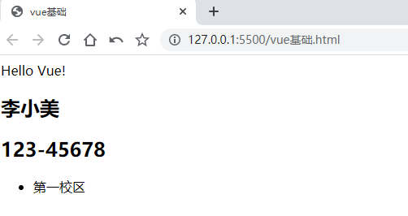

# Vue
## Vue基础
### 第一个vue程序
- 导入开发版本的vue.js
- 创建vue实例对象，设置el属性和data属性。
- 使用简洁的模板语法{{}}把数据渲染到页面上。

Vue.js 的核心是一个允许采用简洁的模板语法来声明式地将数据渲染进 DOM 的系统：
```html
<div id="app">
  {{ message }}
</div>
```

```js
var app = new Vue({
  el: '#app',
  data: {
    message: 'Hello Vue!'
  }
})
```


HTML中的 {{}} 称为差值表达式。作用是将数据跟页面结构关联起来。

“#”在css中是 ID 选择器。el属性指定 vue需要管理id为app的页面元素。
### el：挂载点
通过css选择器设置vue实例管理的元素。el命中的元素中{{}}的部分将会被 data中同名的数据替换。
三个问题
- Vue实例的作用范围是什么？
作用范围在绑定的DOM内部，DOM外部的表达式无效。
```html
<body>
    {{message}}
    <div id="app">
        {{message}}
        <span>{{message}}</span>
    </div>
    <!--开发版本包含完整的警告和调试模式-->
    <script src="https://cdn.jsdelivr.net/npm/vue/dist/vue.js"></script>
    <script>
       var app = new Vue({
            el: '#app',
            data: {
                message: 'Hello Vue!'
            }
        })
    </script>
</body>
```

- 是否可以使用其他的选择器？
-均支持
```js
 el: '.app',
 el: 'div'
```
- 是否可以设置其他的dom元素？
只支持双标签。不能挂载到<html>和<body>。一般选择使用没有样式的<div>。

### data：数据对象
vue需要使用的对象都会在data中，支持数组，对象等等类型。
```html
<body>
    <div id="app" class="app">
        {{message}}
        <h2>{{school.name}}</h2>
        <h2>{{school.mobile}}</h2>
        <ul>
            <li>{{campus[0]}}</li>
        </ul>
    </div>
    <!--开发版本包含完整的警告和调试模式-->
    <script src="https://cdn.jsdelivr.net/npm/vue/dist/vue.js"></script>
    <script>
       var app = new Vue({
            //el: '#app',
            el: 'div',
            data: {
                message: 'Hello Vue!',
                school:{
                    name:"李小美",
                    mobile:"123-45678"
                },
                campus:["第一校区","第二校区","第三校区"]
            }
        })
    </script>
</body>
```

## 本地应用
vue指令
[Vue指令api地址](https://cn.vuejs.org/v2/api/#v-on)

### 1、内容绑定，事件绑定
#### 1.1 、v-text指令
设置标签的文本值（textContent）

```html
<body>
    <div id="app" class="app">
       <h2 v-text="message"></h2>
    </div>
    <!--开发版本包含完整的警告和调试模式-->
    <script src="https://cdn.jsdelivr.net/npm/vue/dist/vue.js"></script>
    <script>
       var app = new Vue({
            el: '#app',
            data: {
                message: 'Hello Vue!',
            }
        })
    </script>
</body>
```
但是这种写法会把绑定的元素文本全部替换，如果只要部分可以使用差值表达式。只要大括号内部的才会替换。
```html
<h2 v-text="message">李小美</h2>
<h2>你好！{{message}}李小美</h2>
```
还支持表达式写法，比如字符串拼接(v-text指令使用了双引号，所以内部拼接需要使用单引号)：
```java
<h2 v-text="message +'!'" ></h2>
<h2>你好！{{message +'!'}}</h2>
```
#### 1.2 v-html指令
v-html指令用于设置标签的innerHTML。对于普通文本，和v-text指令效果相同。如果data数据内容是html结构，就会被解析出来。
```html
<body>
    <div id="app" class="app">
      <p v-html="content"></p>
    </div>
    <!--开发版本包含完整的警告和调试模式-->
    <script src="https://cdn.jsdelivr.net/npm/vue/dist/vue.js"></script>
    <script>
       var app = new Vue({
            el: '#app',
            data: {
                content:"<a href='www.baidu.com'>百度</a>"
            }
        })
    </script>
</body>
```

#### 1.3 v-on指令
##### 绑定事件
v-on指令用于为元素绑定事件。可以将 v-on指令替换为 @符号，他们的功能是一样的。

Vue不需要考虑如何修改DOM元素，重点放在数据的修改上，数据修改对应绑定的DOM元素会同步修改。在方法内部拿到数据需要 this关键字。
```html
<body>
    <div id="app" class="app">
      <input type="button" value="事件绑定" v-on:click="doIt">
      <input type="button" value="鼠标移入" v-on:monseenter="doIt">
      <input type="button" value="双击" v-on:dblclick="doIt">
      <input type="button" value="双击简写" @:dblclick="doIt">
      <h2 @click="changeFood" v-text="food"></h2>
    </div>
    <!--开发版本包含完整的警告和调试模式-->
    <script src="https://cdn.jsdelivr.net/npm/vue/dist/vue.js"></script>
    <script>
       var app = new Vue({
            el: '#app',
            data:{
                food:"西蓝花炒蛋"
            },
            methods:{
                doIt:function(){
                    alert("做it");
                },
                changeFood:function(){
                //console.log(this.food);
                this.food+="好吃";
                }
            },
        })
    </script>
</body>
```
##### 传递自定义参数，事件修饰符
事件修饰符：
- .stop - 调用 event.stopPropagation()。
- .prevent - 调用 event.preventDefault()。
- .capture - 添加事件侦听器时使用 capture 模式。
- .self - 只当事件是从侦听器绑定的元素本身触发时才触发回调。
- .{keyCode | keyAlias} - 只当事件是从特定键触发时才触发回调。
- .native - 监听组件根元素的原生事件。
- .once - 只触发一次回调。
- .left - (2.2.0) 只当点击鼠标左键时触发。
- .right - (2.2.0) 只当点击鼠标右键时触发。
- .middle - (2.2.0) 只当点击鼠标中键时触发。
- .passive - (2.3.0) 以 { passive: true } 模式添加侦听器
- .enter 回车键
使用 .修饰符，限定触发事件

事件绑定的方法可以写成函数调用的方式，传入自定义形参。在方法的实现里使用形参接收即可。
```html
<body>
    <div id="app">
        <input type="button" value="点击" @click="doIt(666,'老铁')">
        <input type="text" @keyup.enter="sayHi">
    </div>
    <!-- 1.开发环境版本，包含了有帮助的命令行警告 -->
    <script src="https://cdn.jsdelivr.net/npm/vue/dist/vue.js"></script>
    <script>
        var app = new Vue({
            el:"#app",
            methods: {
                doIt:function(p1,p2){
                    console.log("做it");
                    console.log(p1);
                    console.log(p2);
                },
                sayHi:function(){
                    alert("吃了没");
                }
            },
        })
    </script>
</body>
```

### 2、显示切换，属性绑定
#### 2.1 v-show指令
根据表达式的真假，切换元素的显示和隐藏
```html
<body>
    <div id="app">
      <input type="button" value="切换显示状态" @click="changeIsShow">
      <input type="button" value="累加年龄" @click="addAge">
      
      =18" src="./img/monkey.gif" alt="">
    </div>
    <!-- 1.开发环境版本，包含了有帮助的命令行警告 -->
    <script src="https://cdn.jsdelivr.net/npm/vue/dist/vue.js"></script>
    <script>
      var app = new Vue({
        el:"#app",
        data:{
          isShow:false,
          age:17
        },
        methods: {
          changeIsShow:function(){
            this.isShow = !this.isShow;
          },
          addAge:function(){
            this.age++;
          }
        },
      })
    </script>
  </body>
```
#### 2.2 v-if指令
根据表达值得真假，切换元素的显示和隐藏（操控dom元素）
与v-show指令效果相同，但是调试可以发现，v-show指令绑定的元素标签一直存在，知识通过修改display属性来切换是否显示。而v-if修饰的标签隐藏时是直接从dom树中移除了。需要频繁切换的元素一般使用v-show，反之使用v-if。移除和添加dom树西药消耗性能。
```html
<body>
    <div id="app">
        <input type="button" value="切换显示" @click="toggleIsShow">
        <p v-if="isShow">黑马程序员</p>
        <p v-show="isShow">黑马程序员 - v-show修饰</p>
        <h2 v-if="temperature>=35">热死啦</h2>
    </div>
    <!-- 开发环境版本，包含了有帮助的命令行警告 -->
    <script src="https://cdn.jsdelivr.net/npm/vue/dist/vue.js"></script>
    <script>
        var app = new Vue({
            el:"#app",
            data:{
                isShow:false,
                temperature:20
            },
            methods: {
                toggleIsShow:function(){
                    this.isShow = !this.isShow;
                }
            },
        })
    </script>
</body>
```
#### 2.3 v-bind指令
设置元素的属性,可以省略使用“：”代替：
src，id、class、name、style、type、value，title等。
用法： v-bind:属性名=表达式
```html

```
### 3、列表循环，表单元素绑定
#### 3.1 v-for指令
根据数据生成列表结构
```html
<body>
    <div id="app">
        <input type="button" value="添加数据" @click="add">
        <input type="button" value="移除数据" @click="remove">

        <ul>
            <li v-for="(it,index) in arr">
                {{ index+1 }}黑马程序员校区:{{ it }}
            </li>
        </ul>
        <h2 v-for="item in vegetables" v-bind:title="item.name">
            {{ item.name }}
        </h2>
    </div>
    <!-- 1.开发环境版本，包含了有帮助的命令行警告 -->
    <script src="https://cdn.jsdelivr.net/npm/vue/dist/vue.js"></script>
    <script>
        var app = new Vue({
            el:"#app",
            data:{
                arr:["北京","上海","广州","深圳"],
                vegetables:[
                    {name:"西兰花炒蛋"},
                    {name:"蛋炒西蓝花"}
                ]
            },
            methods: {
                add:function(){
                    this.vegetables.push({ name:"花菜炒蛋" });
                },
                remove:function(){
                    this.vegetables.shift();
                }
            },
        })
    </script>
</body>
```
#### 3.2 v-model指令
获取和设置表单元素的值（双向数据绑定）
```html
<body>
    <div id="app">
        <input type="button" value="修改message" @click="setM">
        <input type="text" v-model="message" @keyup.enter="getM">
        <h2>{{ message }}</h2>
    </div>
    <!-- 开发环境版本，包含了有帮助的命令行警告 -->
    <script src="https://cdn.jsdelivr.net/npm/vue/dist/vue.js"></script>
    <script>
        var app = new Vue({
            el:"#app",
            data:{
                message:"黑马程序员"
            },
            methods: {
                getM:function(){
                    alert(this.message);
                },
                setM:function(){
                    this.message ="酷丁鱼";
                }
            },
        })
    </script>
</body>
```
## 网络应用
结合网络数据开发
### axios 网络请求库
```javascript
  <!-- 官网提供的 axios 在线地址 -->
  <script src="https://unpkg.com/axios/dist/axios.min.js"></script>
  
  axios.get(地址？key=value&key2=value2).then(function(respose){},function(err){})
  axios.post(地址？key=value&key2=value2).then(function(respose){},function(err){})
```