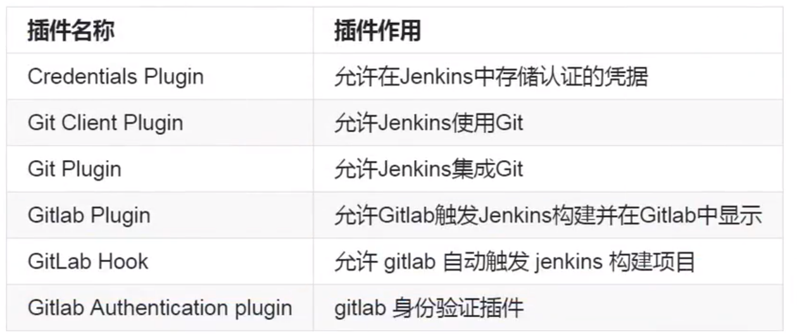

# GitLab Jenkins Sonar Qube 持续集成实践
持续集成：
提交代码->代码托管->获取代码->代码测试->构建->黑盒测试->部署->回退
## 1、GIT基本操作
### 1、配置GIT（.gitconfig）
```shell
git config --global username "XX"
git config --global user.email "XX@xx.com"
git config --global color.ui true #启用默认的颜色设置
```
### 2、创建本地仓库
```shell
mkdir learngit
cd learngit
git init #初始化目录为git目录
```
### 3、提交目录文件到本地git仓库
```shell
touch file1 file2 file3
git status
git add file1 file2 file3  #把文件提交到暂存区
-- git add .  #全部提交到暂存区
git rm --cached file  #撤销操作
git status
git commit  -m "注释：新增file1,file2,file3到本地仓库" #把暂存区的文件提交到本地仓库管理，相当于对文件做了一次快照，可以使用git log 查看。 git log -- oneline
git status
```
### 4、文件改名并提交
```shell
mv file file1 
git status #显示file删除，file1新增
git -rm file
git -add file1
git status #显示file  rename 为file1
git commit -m "修改file为file1"
```
```shell
git mv file file1
git status # rename
git commit -m "修改file为file1"
```
### 5、文件比较(本地文件、暂存区、仓库文件间的比对)
```shell
$ git diff file #比较file本地和暂存区的区别
$ git diff --cached  file #比较暂存区和本地仓库的区别
```
### 6、撤销回退
```shell
#本地到暂存区
$ >file #误操作导致文件清空了
git checkout -- file #假设之前提交到缓存区了，可以使用以前提交至暂存区的内容覆盖本地工作目录
```
```shell
#暂存区到本地仓库
#本地仓库提交至暂存区如何回退
#思路：先将仓库的文件回退到暂存区，再将暂存区的覆盖至本地工作目录
$ >file #误操作导致文件清空了
$ git add . #提交至暂存区
$ git status # 本地与暂存区一致
$ git reset HEAD file # 本地仓库覆盖暂存区
$ git status
$ git checkout -- file #暂存区的内容覆盖本地工作目录
$ git status
```
```shell
#已经多次提交到本地仓库
#思路：找到想要还原的版本对应仓库的快照（commitid），还原
$ echo "XXXX@XX.com">file
$ git add . 
git commit -m "提交至本地仓库"
$ echo "XXXX2@XX.com">file
$ git add . 
$ git commit -m "提交至本地仓库2"
# 现在想回退到 XXXX@XX.com 的版本
$ git log --oneline #找到commitid
$ git status
$ git reset --hard commitid #直接覆盖了本地目录，无需再进行暂存区回退操作
#这时git log 已经看不到XXXX2@XX.com版本的记录了,可以使用 git reflog查看所有记录
$ git reflog
```
### 7、分支管理（创建，合并，删除）
```shell
#查看分支
$ git branch
#创建分支
$ git branch devops #此时仍然处于master分支
# 切换分支
$ git checkout devops

$ touch file1
$ touch file2
$ touch file3#假设此时开发完成
```
```shell
#假设此时master已经更新
$ git branch master
$ touch file4 file5
$ git add .
$ git commit -m "new file4 file5"
#合并分支，此时master可能有其他人提交的代码。master是新的，devops是旧的。所以要用devops合并master更新。
$ git merge master   -m "devops 合并到master" #把master更新过来
$git status
# 假设此时测试完成，没有问题。需要用master合并devops分支。
$ git branch master
$ git merge devops
#此时devops已经没用，需要删除
$ git branch -d devops
```
```shell
###分支合并冲突
$ git branch dev
$ vi file1 ##添加一行 aaaaa
$ git add .
$ git commit -m "new file1"
$ git branch dev
$ vi file1 ##在同一行添加 bbbbb
$ git add .
$ git commit -m "new file1  2"
# dev 合并master
$ git merge master
# 此时报错，需要手动调整。
```
### 8、标签管理（创建，删除）
确定需要创建标签的分支，一般都是master。每个分支有自己的标签,标签会关联一个commitid，标签是静止的，不会变化

1, 对当前最新提交的代码创建标签 -a 标签名称  -m 标签描述
```shell
$ git tag #查看标签
$ git tag -a "v1.0" -m "项目刚刚发布，发布内容：拍照，文件导入..."
$ git tag
$ git show v1.0#查看tag关联的commitid
```
2,指定一个commitid作为关联
```shell
$ git tag #查看标签
$ git tag -a   "v1.0"  q3cc59e  -m "发布功能：增加安全模块"
$ git tag
$ git show v1.0#查看tag关联的commitid
```
3,删除标签
```shell
$ git tag -d v1.0
```
## 2、gitlab
先建组，再建项目，把项目权限分给组
### 1、Git全局设置
```shell
git config --global username "XX"
git config --global user.email "XX@xx.com"
```
### 2、创建一个新仓库(任选其一)
1,Git 全局设置:
```shell
git config --global user.name "mrliychn"
git config --global user.email "41217324@qq.com"
```
2,创建 git 仓库:
```shell
mkdir notes
cd notes
git init
touch README.md
git add README.md
git commit -m "first commit"
git remote add origin https://gitee.com/mrliychn/notes.git
git push -u origin master
```
3,已有仓库?
```shell
cd existing_git_repo
git remote add origin https://gitee.com/mrliychn/notes.git
git push -u origin master
```
### 3、跳过密码验证（使用ssh不用http）
``` shell
git remote -v
git remote remove origin #删除http连接的远程连接
git  remote add orgin git@XXXXXXXX.git # 添加git连接
```
### 4、添加SSHkey
```shell
cat ~/.ssh/id_rsa.pub
```
将 上面的公钥加到    设置--SSH密钥--密钥里，点击添加密钥。标题可写为 ip+用户的公钥，防止忘记。
### 5、创建分支，标签
```shell
#1,删除远程分支    
git branch -r -d origin/branch-name  
git push origin :branch-name 
#2,如果远程新建了一个分支，本地没有该分支,可以利用 git checkout --track origin/branch_name ，这时本地会新建一个分支名叫 branch_name ，会自动跟踪远程的同名分支 branch_name。
git checkout --track origin/branch_name
#3,如果本地新建了一个分支 branch_name，但是在远程没有。
#这时候 push 和 pull 指令就无法确定该跟踪谁，一般来说我们都会使其跟踪远程同名分支，所以可以利用 git push --set-upstream origin branch_name ，这样就可以自动在远程创建一个 branch_name 分支，然后本地分支会 track 该分支。后面再对该分支使用 push 和 pull 就自动同步
git push --set-upstream origin branch_name
#4合并分支到master上,首先切换到master分支上
#如果是多人开发的话 需要把远程master上的代码pull下来
#然后我们把dev分支的代码合并到master上
#然后查看状态
git  checkout master
git pull origin master
git  merge dev
git status
```
标签
```shell
$ git tag -a "v1.1" -m "说明"
$ git push origin v1.1
```
## 3、Jenkins +gitlab
开源持续集成工具，本身是个调度平台，本身不处理任何事情，调用插件完成所有的工作
1,代码提交至gitlab
2,jenkins安装gitlab需要的插件
3,jenkins创建freestyle项目，配置gitlab地址
### 1，安装
```shell
#多种方式可选，此处选择rpm安装,需要下载依赖。离线环境可下载war包在tomcat启动
#官网下载rpm包
$ yum localinstall jenkins-2.222.1-1.2.noarch.rpm
#启动 8080端口
$ systemctl start jenkins
 systemctl status jenkins
```
```shell
# 设置开机启动:
systemctl enable jenkins.service
# 启动:
systemctl start jenkins.service
# 重新启动:
systemctl restart jenkins.service
# 查看状态:
systemctl status jenkins.service
#检查进程:
netstat -lntup
```
gitlab相关插件


通过拷贝Jenkins插件到插件目录,也可以相当于安装插件.
```shell
jenkins插件目录: /var/lib/jenkins/plugins/

rz plugins.tar.gz 
tar xf plugins.tar.gz -C /var/lib/jenkins/plugins/
cd /var/lib/jenkins/plugins/
mv plugins/* ./
rm -fr plugins/

systemctl restart jenkins.service 
```
### 1，Jenkins集成Gitlab、Maven
1, 提交代码至gitlab
2,  jenkins安装插件（需要在jenkins部署的机器上安装git）
3，jenkin创建freestyle项目，配置仓库地址（需要在gitlab上配置jenkins用户，将公钥加到gitlab，Jenkins无法访问所在服务器的私钥，需要手动将私钥拷到Jenkins）
4，Jenkins安装Maven Integration plugin插件（配置参数 package -D maven.test.skip=true ）
