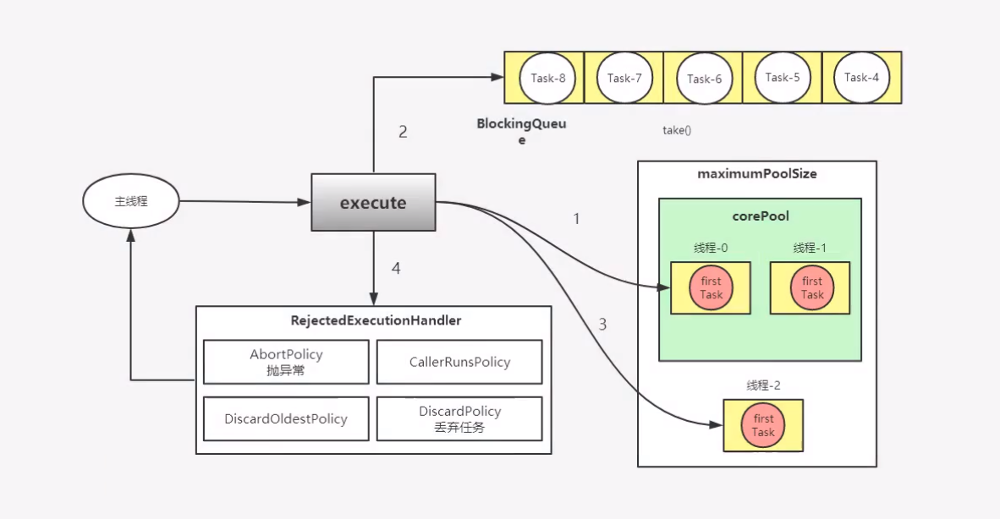
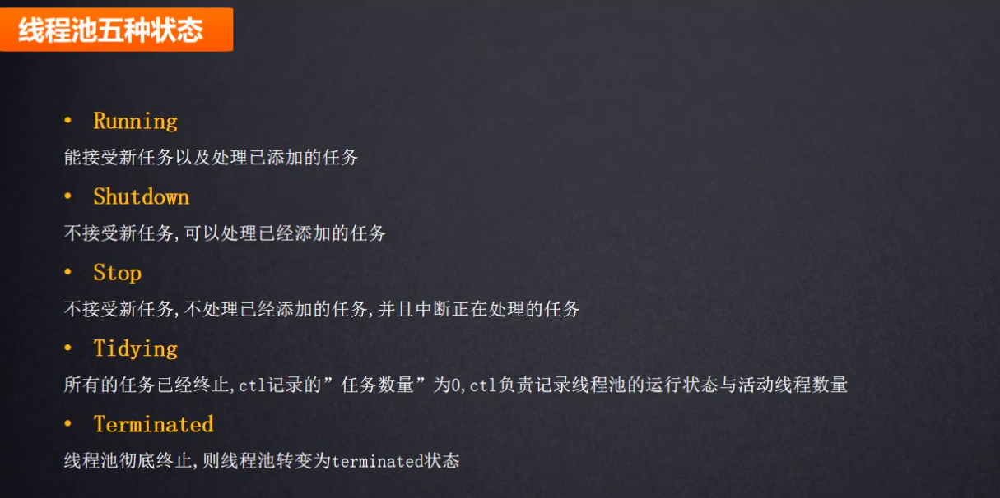
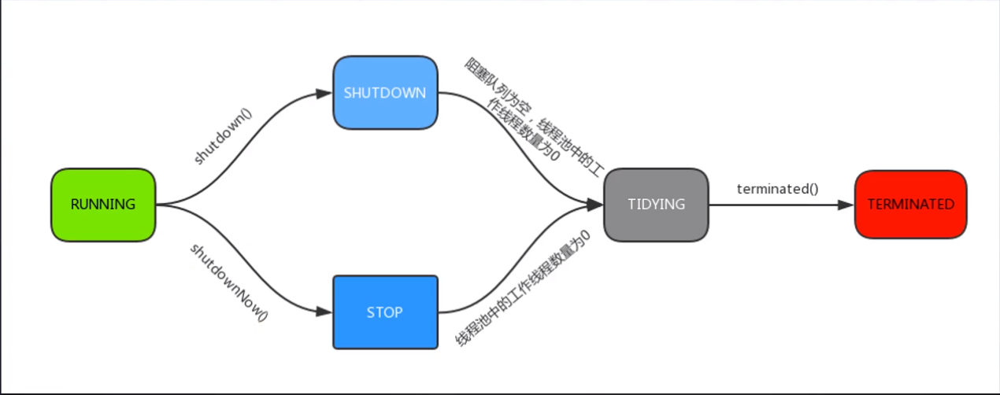
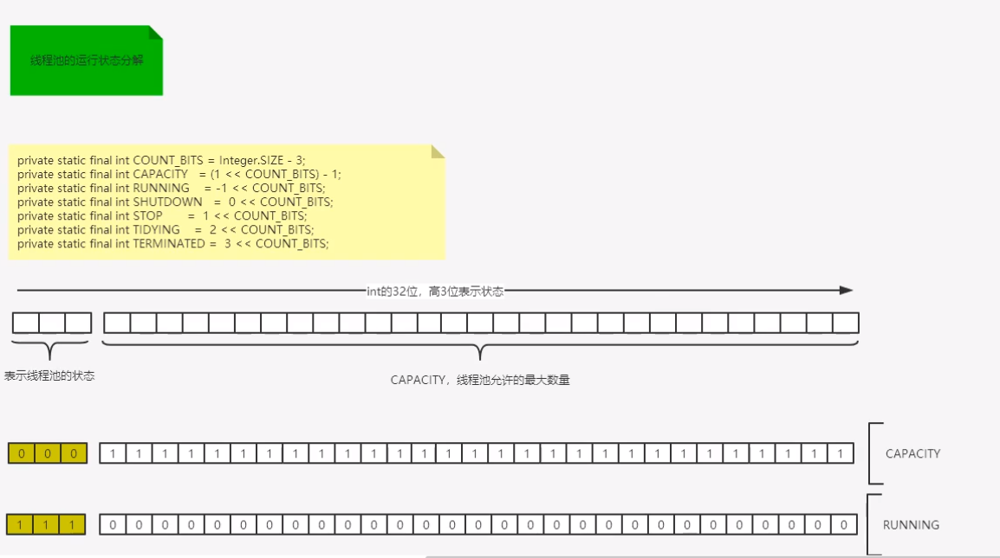

# 线程池
线程是稀缺资源，线程的创建和销毁是一个相对偏重且耗资源的过程。Java线程依赖于内核线程，创建线程需要进行操作系统状态切换，为避免资源过度消耗需要设法重用线程执行多个任务。线程池就是一个线程缓存，负责对线程进行统一分配、调优和监控。

什么时候使用线程池：
- 单个任务处理时间较短.
- 需要处理的任务数量很大

线程池优势：
- 重用存在的线程，减少线程的创建、销毁的开销，提高性能。
- 提高响应速度，当任务到达时，可以不需要等待线程创建就能执行。
- 提高线程的可管理性，可统一分配、调优和监控。

## 原理解析


```java
    public static void main(String[] args) {
        final ThreadPoolExecutor   pool=new ThreadPoolExecutor(2,3,60,
                TimeUnit.SECONDS,new ArrayBlockingQueue<Runnable>(5), Executors.defaultThreadFactory());
        for (int i = 0; i < 9; i++) {
            pool.execute(new task());
        }
        pool.shutdown();
    }
```
线程池初始化，此时提交了两个任务，会创建两个核心线程。第三个任务来的时候，由于最大核心线程数是2，此任务会进入堵塞队列（此处大小为5）。如果已经有五个线程在阻塞队列排队。第八个线程无法入队列，此时会创建一个临时线程（临时工）去领取任务，所以不能保证线程执行的顺序（先来的不一定先执行，非核心线程可能在阻塞线程之前）。若此时第九个任务提交的时候，核心线程和临时线程都在执行任务且阻塞队列也已经满了，线程池会启动拒绝策略，自动拒绝此线程。拒绝的策略可以自定义，默认是抛异常：
- 
最大线程数是3，核心线程数是2。相当于2个正式工+1个临时工，如果临时工空闲超过60s（参数）,就解聘。

```java
    public ThreadPoolExecutor(int corePoolSize,   //核心线程数大小
                              int maximumPoolSize, //最多创建多少个线程
                              long keepAliveTime,//线程没有工作，最多空闲多久
                              TimeUnit unit, // 指定时间单位
                              BlockingQueue<Runnable> workQueue,  //一旦线程池处于满负荷工作状态下，新任务来的时候会进入阻塞队列
                              ThreadFactory threadFactory) {
        this(corePoolSize, maximumPoolSize, keepAliveTime, unit, workQueue,
             threadFactory, defaultHandler);
    }
```
堵塞队列：在任意时刻，不管并发多高，永远只有一个线程能进行队列的入队或出队操作。线程安全的队列。堵塞队列满了之后，只能进行出队操作，所以入队操作被堵塞。

## 线程池的五种状态




### 线程池的线程安全处理


```java
private final AtomicInteger ctl = new AtomicInteger(ctlOf(RUNNING, 0));
private static final int COUNT_BITS = Integer.SIZE - 3;         //=29
private static final int CAPACITY   = (1 << COUNT_BITS) - 1;
//使用高三位表示线程池的生命状态（5种）
//低29位记录线程数
// runState is stored in the high-order bits

//-数的位运算  -1=1000 0000 0000 0000 0000 0000 0000 0001（负数以补码,符号位不变，其余位取反+1保存）
//            -1=1111 1111 1111 1111 1111 1111 1111 1111
//左移29位      =1110 0000 0000 0000 0000 0000 0000 0000 （111=running）
private static final int RUNNING    = -1 << COUNT_BITS;//向左位移29位
//000
private static final int SHUTDOWN   =  0 << COUNT_BITS;
//001
private static final int STOP       =  1 << COUNT_BITS;
//010
private static final int TIDYING    =  2 << COUNT_BITS;
//011
private static final int TERMINATED =  3 << COUNT_BITS;

// Packing and unpacking ctl
//得到运行状态
private static int runStateOf(int c)     { return c & ~CAPACITY; }
//得到工作线程数量
private static int workerCountOf(int c)  { return c & CAPACITY; }
//初始化ctl
private static int ctlOf(int rs, int wc) { return rs | wc; }
```
线程池中 把当前线程生命状态和当前有多少线程等信息都记录在一个 Integer（32位） 变量里。如果使用多个变量记录，在修改的过程中需要使用同步手段去同步修改这些变量，影响性能。
使用高三位表示线程池的生命状态（5种），低29位记录线程数。